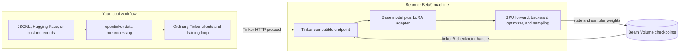

# OpenTinker

OpenTinker is a Beam/Beta9 compute backend for the upstream
[`tinker`](https://pypi.org/project/tinker/) SDK. Your training code keeps using
Tinker's `ServiceClient`, `TrainingClient`, datums, futures, renderers, metrics,
and Cookbook recipes. Model forward/backward, AdamW, LoRA weights, sampling,
and checkpoint I/O execute in a PyTorch container on a Beam-hosted GPU, a
temporarily reserved machine, or hardware you attach yourself.

This is not a launcher that sends the expensive work back to Tinker's managed
service. The adapter starts a Tinker-compatible endpoint in a Beam Pod and
points the ordinary Tinker client at it.

## System overview



The local process owns the readable workflow: loading data, choosing batches,
calling Tinker methods, and reporting metrics. The Beam machine owns expensive
model compute. The compatibility endpoint translates the normal Tinker HTTP
contract into local PyTorch/PEFT operations, so Cookbook code does not need a
second API. Checkpoints outlive the machine in a Beam Volume and can be loaded
later through their `tinker://` handles.

See [System diagrams](docs/system-diagrams.md) for separate, annotated
fine-tuning and distillation flows.

## Monitor every run

As soon as Beam creates the Pod—before model download or readiness waits—every
workflow prints the provider's direct management URL when available, or Beam's
live Containers dashboard as a fallback. The container ID, app name, and exact
attach command appear beside it:

```text
OpenTinker Pod created: pod-...
  dashboard: https://...
  attach:    beam --context prod3 container attach pod-...
  app:       tinker-training
  Ctrl+C stops the training loop, flushes completed checkpoints, and terminates this Pod.
```

The same values are available as `adapter.dashboard_url` and
`adapter.container_id`, including after the context exits, so surrounding
tools can link to the run history. Because the local Tinker loop orchestrates
each training step, Ctrl+C intentionally ends the run rather than pretending
it can continue detached. OpenTinker reports the dashboard again, flushes any
already-created checkpoints to the Volume, terminates the Pod, and releases
only an on-demand machine it reserved itself. If cleanup is incomplete, it
prints exact `container stop` and `machine release` recovery commands.

## Why “open” means bring your own GPU

The Tinker workflow is not coupled to Beam's hosted fleet. All runnable
examples use the same three hardware choices:

| What runs the job | Options |
| --- | --- |
| Beam serverless A10G | no hardware flags |
| A temporary on-demand machine | `--on-demand`, optionally with `--gpu H100` |
| Your own machine or an existing pool | `--pool my-gpus` |

For an existing or private pool, OpenTinker discovers the GPU type from its
connected machines. A job therefore needs only `--pool my-gpus`; it does not
repeat hardware configuration already known to Beam.

Attach an NVIDIA host with `beam pool join`, or create a pool and print an
installer to run on the host:

```bash
# Run directly on the GPU host
beam pool join opentinker-gpus --gpu H100 --max-gpus 1 --background

# Then run any OpenTinker workflow from your workstation
uv run python examples/finetune_jsonl.py ./my-data.jsonl \
  --profile default --pool opentinker-gpus
```

See [Bring your own hardware](docs/bring-your-own-hardware.md) for the complete
serverless, `machine reserve`, private-pool installer, and self-hosted Beta9
flows.

## What you need

- Python 3.11 or newer
- a [Beam](https://beam.cloud) account, or a self-hosted Beta9 cluster
- a configured CLI profile (`beam configure`)
- Hugging Face access for the model and dataset you choose; add an `HF_TOKEN`
  Beam secret for gated models or higher download limits

Clone this repository, then install the package and the official Tinker
Cookbook:

```bash
uv sync --extra beam --extra examples
```

Plain pip also works:

```bash
python -m pip install -e '.[beam,examples]'
```

## Fine-tune a real model on a real dataset

This command runs the upstream
[`tinker_cookbook.recipes.sl_loop`](https://github.com/thinking-machines-lab/tinker-cookbook/blob/main/tinker_cookbook/recipes/sl_loop.py)
on `HuggingFaceH4/no_robots`. The recipe downloads the dataset, renders real
conversations into Tinker datums, performs LoRA forward/backward and AdamW
steps on an A10G, logs per-step NLL/BPB metrics, and saves its final state and
sampler checkpoints to a Beam Volume.

```bash
uv run python examples/cookbook_sl_loop.py \
  --profile default \
  --steps 20 \
  --batch-size 4 \
  --max-length 1024 \
  --log-path ./runs/no-robots
```

With no compute flags, OpenTinker requests an A10G from Beam's serverless pool.

### Fine-tune your own JSONL

The simplest dataset format is one OpenAI-style conversation per line:

```json
{"messages":[{"role":"system","content":"Return compact JSON."},{"role":"user","content":"Checkout is down."},{"role":"assistant","content":"{\"priority\":\"P0\",\"team\":\"payments\"}"}]}
```

Run it directly—no custom dataset class is required:

```bash
uv run python examples/finetune_jsonl.py ./my-data.jsonl \
  --eval-data ./my-held-out-data.jsonl \
  --profile default --on-demand --gpu A16
```

`opentinker.data` validates the records, asks the selected Cookbook renderer to
tokenize them, creates target tokens and loss weights, and returns ordinary
Tinker `Datum`s. By default only the final assistant answer receives loss. Use
`--train-on all_assistant_messages` for multi-turn assistant supervision.
When `--eval-data` is omitted, the example's before/after NLL check uses up to
eight training rows; pass a separate file for a meaningful held-out check.

See [Data preparation](docs/data-preparation.md) for complete SFT and
distillation schemas, custom preprocessing examples, loss-mask choices, and
the reusable Python helpers. Runnable sample files live in
[`examples/data/`](examples/data/).

## Distill a tool-planning skill into a smaller model

`distill_tool_planner.py` performs real sequence-level distillation on one
Beam GPU. A 4B teacher generates executable six-step analytics plans, a strict
verifier admits only exact JSON plans with valid tool arguments and `$sN`
dependencies, and the regular Tinker supervised APIs train a 0.6B student on
the verified teacher outputs. The student sees only the short user request—it
does not receive the teacher's schema contract.

```bash
uv run python examples/distill_tool_planner.py \
  --profile default \
  --on-demand \
  --gpu A16
```

The example evaluates the untouched student, the teacher, and a fresh sampling
client loaded from the student's saved sampler checkpoint on six unseen
requests. It writes the teacher dataset and full per-case results under
`runs/tool-planner-distillation/` and fails if distillation does not improve
the held-out exact-match score.

The durable teacher-data format is deliberately simple:

```json
{"prompt":"...","teacher_response":"...","verified":true}
```

`distillation_records_to_datums(...)` turns those rows into student
conversations and trains only on the teacher response. The included example
shows where to put the teacher-only contract, how to reject bad generations,
and how to keep held-out evaluation prompts separate.

A production run on an arbitrary prod3 A16 produced:

```text
Qwen/Qwen3-0.6B base student       0/6 exact
Qwen/Qwen3-4B-Instruct teacher    6/6 exact
distilled Qwen/Qwen3-0.6B         6/6 exact
verified teacher demonstrations 18/18
training NLL                1.309702 -> 0.000015
fresh-machine checkpoint eval      6/6 exact
```

The fresh-machine score came from a second A16 reservation after the training
Pod and machine had been terminated, using only the persisted sampler handle.

This is prompt/sequence distillation using Tinker sampling, datum, training,
checkpoint, and sampling-client interfaces. It is not logit/top-k or full
on-policy distillation; those require protocol operations not yet implemented
by the single-node backend.

Re-evaluate the returned sampler checkpoint on a newly reserved GPU without
regenerating teacher data or training:

```bash
uv run python examples/distill_tool_planner.py \
  --profile default --on-demand --gpu A16 \
  --checkpoint tinker://<model-id>/sampler_weights/<name>
```

## Choose where compute runs

Add `--on-demand` without a GPU to open Beam's native hardware picker inside
the training command:

```bash
uv run python examples/cookbook_sl_loop.py \
  --profile default --on-demand --steps 20
```

The picker shows every currently available offer with its GPU count, region,
hourly price, and provider. After you confirm an offer, OpenTinker discovers
the selected GPU, binds the training Pod to the new pool, and releases the
machine when the adapter exits. The image is built before the picker opens, so
paid hardware is not held during image construction.

Filter the picker when you already know the GPU family you want:

```bash
uv run python examples/cookbook_sl_loop.py \
  --profile default --on-demand --gpu H100 --steps 20
```

Reservations have a one-hour safety TTL by default; change it with
`--machine-ttl 6h`. In a headless process the Beam CLI selects the cheapest
matching offer without prompting, so pass `--gpu` for deterministic automation.
You can also use an existing private pool with `--pool your-existing-pool`
without `--on-demand`. Its GPU is discovered automatically, and OpenTinker
does not release a pool it did not create. To attach your own machine to that
pool, follow [Bring your own hardware](docs/bring-your-own-hardware.md).

## Use the Cookbook recipe in your own code

The wrapper is deliberately small. The training loop below is the official
Cookbook implementation, not a parallel OpenTinker trainer:

```python
from tinker_cookbook.recipes.sl_loop import Config
from tinker_cookbook.recipes.sl_loop import main as supervised_fine_tune

from opentinker import BeamComputeAdapter

with BeamComputeAdapter(
    base_model="Qwen/Qwen3-4B-Instruct-2507",
    gpu="A10G",
    profile="default",
    volume_name="tinker-checkpoints",
    max_length=1024,
):
    supervised_fine_tune(
        Config(
            model_name="Qwen/Qwen3-4B-Instruct-2507",
            batch_size=4,
            max_length=1024,
            max_steps=20,
            log_path="./runs/no-robots",
        )
    )
```

The recipe creates its own `tinker.ServiceClient()`. While the adapter context
is active, that client is transparently routed to the Beam backend. No recipe
fork is required.

The Python API has the same interactive path. Leaving `gpu` unset while using
`on_demand=True` opens the unfiltered Beam picker:

```python
with BeamComputeAdapter(
    base_model="Qwen/Qwen3-4B-Instruct-2507",
    profile="default",
    on_demand=True,
) as service_client:
    ...
```

## Tinker checkpoint handles, backed by a Beam Volume

OpenTinker creates or reuses the named `tinker-checkpoints` Volume. Tinker's
`save_state()` and `save_weights_for_sampler()` return normal Tinker handles:

```text
tinker://<model-id>/weights/final
tinker://<model-id>/sampler_weights/final
```

Pass those handles unchanged to `load_state()`,
`create_training_client_from_state_with_optimizer()`, or
`create_sampling_client(model_path=...)`. The physical files use the matching
Beam paths:

```text
beam://tinker-checkpoints/checkpoints/<model-id>/weights/final
beam://tinker-checkpoints/checkpoints/<model-id>/sampler_weights/final
```

Inspect them with the Beam CLI. On clusters whose multipart file service
allows downloads, copy them locally with `beam cp`:

```bash
beam ls tinker-checkpoints/checkpoints
beam cp \
  beam://tinker-checkpoints/checkpoints/<model-id>/weights/final \
  ./checkpoints/final
```

Local download is optional: training and sampling clients load the
`tinker://` handle directly from the mounted Beam Volume.

Each checkpoint directory contains PEFT adapter weights, adapter config,
`opentinker.json` metadata, and (for state checkpoints) `optimizer.pt`. Rerun
the Cookbook command with the same `--log-path` to use its normal
`checkpoints.jsonl` resume flow, including optimizer state.

External on-demand providers do not all publish SDK Volume mounts back to the
cluster. Before releasing a machine, OpenTinker therefore exports every live
checkpoint through the authorized Pod, uploads it with your local Beam
profile, and waits until the Volume API can see it. Your Beam credential stays
on your machine; it is not injected into the training container.

You can also evaluate a saved adapter against held-out No Robots conversations:

```bash
uv run python examples/evaluate_checkpoint.py \
  tinker://<model-id>/weights/final \
  --profile default --gpu A10G --examples 8
```

This evaluates a fresh base model, loads the checkpoint through Tinker's normal
`TrainingClient.load_state()`, evaluates the same held-out batch again, and
fails unless mean NLL improves.

To exercise Tinker's complete state-and-optimizer resume path explicitly:

```bash
uv run python examples/evaluate_checkpoint.py \
  tinker://<model-id>/weights/final \
  --profile default --gpu A10G --resume-with-optimizer
```

## Ordinary Tinker code also works

```python
import opentinker as tinker

adapter = tinker.BeamComputeAdapter(
    base_model="Qwen/Qwen3-0.6B",
    gpu="A10G",
    profile="default",
)

with adapter as service_client:
    training_client = service_client.create_lora_training_client(
        base_model="Qwen/Qwen3-0.6B",
        rank=8,
    )
    # Tinker Datum -> forward_backward -> optim_step -> save_state
```

`import opentinker as tinker` delegates Tinker's public API, so the rest of a
normal Tinker program does not need a second set of types or helpers.

## Compatibility

The current single-node backend supports:

- upstream Tinker `ServiceClient`, `TrainingClient`, and `SamplingClient`
- PEFT LoRA causal-language-model training
- token-input cross-entropy and importance-sampling losses
- `forward`, `forward_backward`, and AdamW `optim_step`
- state and sampler checkpoints in a named Beam Volume
- checkpoint weight loading and optimizer-state resume
- sequence-level teacher/student distillation with different base models on
  one GPU
- the Cookbook supervised `sl_loop`, including its No Robots dataset,
  renderers, metrics, final checkpoints, and local resume record

It does not yet implement distributed/multi-node training, multimodal inputs,
arbitrary custom loss functions, or the full Tinker account-management REST
API. The adapter's temporary `tinker.ServiceClient` override is process-global;
do not run two adapter contexts concurrently in one Python process.

## Why there is an endpoint

The upstream Tinker SDK is an HTTP client. Preserving its unmodified clients
and futures requires a compatibility endpoint between the local workflow and
the remote GPU. OpenTinker runs that endpoint inside the Beam Pod. Future
retrieval is long-polled so model downloads and GPU steps do not generate a
tight `try_again` request loop.

See [`examples/`](examples/) for real Cookbook fine-tuning, verified
teacher-to-student distillation, checkpoint evaluation, and a tiny smoke test.
