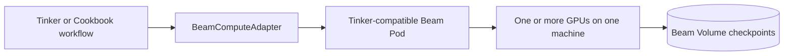

# OpenTinker

Run the upstream [`tinker`](https://pypi.org/project/tinker/) SDK on GPUs
managed by [Beam](https://beam.cloud) or a self-hosted Beta9 cluster.

`BeamComputeAdapter` starts a Tinker-compatible endpoint beside a
Transformers/PEFT training engine. Your existing Tinker or Cookbook loop keeps
using `ServiceClient`, datums, futures, renderers, metrics, and checkpoints;
model forward/backward, AdamW, LoRA training, and sampling happen on the GPU
you selected. No model work is forwarded to Tinker's managed service.



## Install

You need Python 3.11+, a configured Beam/Beta9 profile, and Hugging Face access
to the models you choose.

```bash
uv sync --extra beam --extra examples
# or: python -m pip install -e '.[beam,examples]'
```

## Fine-tune with the Tinker Cookbook

This runs the official Cookbook supervised loop on
`HuggingFaceH4/no_robots`. With no hardware flags, Beam supplies an A10G.

```bash
uv run python examples/cookbook_sl_loop.py \
  --profile default --steps 20 --batch-size 4 --max-length 1024 \
  --log-path ./runs/no-robots
```

To fine-tune your own data, put one OpenAI-style conversation on each JSONL
line:

```json
{"messages":[{"role":"user","content":"Checkout is down."},{"role":"assistant","content":"{\"priority\":\"P0\",\"team\":\"payments\"}"}]}
```

```bash
uv run python examples/finetune_jsonl.py ./train.jsonl \
  --eval-data ./held-out.jsonl --profile default
```

The preprocessing helpers validate messages, apply the model's Cookbook
renderer, and produce ordinary Tinker `Datum`s with assistant-only loss masks.
See [Data preparation](docs/data-preparation.md) for custom schemas.

## Distill a useful skill into a small model

[`distill_support_router.py`](examples/distill_support_router.py) uses the real
[`mteb/banking77`](https://huggingface.co/datasets/mteb/banking77) support
dataset to teach a small model to route banking tickets. A
[`Qwen3-14B`](https://huggingface.co/Qwen/Qwen3-14B) teacher labels messages
for 16 easily confused intents; a strict verifier admits only labels whose
intent, queue, and priority exactly match the dataset policy. The verified
answers train a [`Qwen3-0.6B`](https://huggingface.co/Qwen/Qwen3-0.6B)
student.

```bash
uv run python examples/distill_support_router.py \
  --profile default --on-demand --gpu L40S
```

The example makes an honest inference A/B comparison on untouched Banking77
test rows:

```text
same held-out tickets
├── untouched Qwen3-0.6B
├── Qwen3-14B teacher
└── distilled Qwen3-0.6B loaded from its saved checkpoint
```

One verified `prod3` run on an L40S measured:

```text
untouched Qwen3-0.6B       0/32 exact
Qwen3-14B teacher         31/32 exact
distilled Qwen3-0.6B      23/32 exact (71.9%)
fresh A10G checkpoint     23/32 exact
verified teacher rows     96/114 attempts
first/last batch NLL      2.654 -> 0.003
```

The fresh score came from a second pod after the L40S training pod and
reservation had terminated.

It fails unless the distilled checkpoint beats the untouched student and
reaches the configured minimum exact-match accuracy. The output directory
contains every teacher attempt, the accepted training JSONL, per-case
predictions, metrics, and checkpoint handles.

Re-run only the A/B test on a fresh GPU:

```bash
uv run python examples/distill_support_router.py \
  --profile default --gpu A10G \
  --checkpoint tinker://<model-id>/sampler_weights/<name>
```

See [Practical distillation](docs/distillation.md) for the data boundary,
verification strategy, evaluation design, and ways to adapt the task.

## Choose the GPU

Every example uses the same three modes:

| Command flags | Capacity |
| --- | --- |
| none | Beam serverless A10G |
| `--on-demand` | interactive Beam hardware picker |
| `--on-demand --gpu L40S` | cheapest available matching reservation |
| `--pool my-gpus` | your existing or self-hosted pool |

For example:

```bash
# Reserve marketplace capacity as part of the run
uv run python examples/cookbook_sl_loop.py \
  --profile default --on-demand --gpu H100 --steps 20

# Use every GPU in a 4x machine; fail early unless every pair has NVLink
uv run python examples/cookbook_sl_loop.py \
  --profile default --on-demand --gpu H100 \
  --gpu-count 4 --interconnect nvlink --batch-size 16 --steps 20

# Run the same workflow on a GPU you attached to Beam
beam pool join opentinker-gpus --gpu H100 --max-gpus 1 --background
uv run python examples/cookbook_sl_loop.py \
  --profile default --pool opentinker-gpus --steps 20
```

`--on-demand` without `--gpu` opens Beam's native picker. `--pool` discovers
the connected GPU automatically, and OpenTinker never releases capacity it
did not create. See [Bring your own hardware](docs/bring-your-own-hardware.md)
for private-pool installers, `machine reserve`, and self-hosted Beta9.

`--gpu-count N` is one distributed training job, not N independent Pods.
Beta9 places all N devices in one container on one machine; OpenTinker launches
one PyTorch process per GPU and DDP synchronizes LoRA gradients with NCCL. NCCL
uses NVLink or NVSwitch automatically when the machine has it.
For unattended on-demand runs, OpenTinker selects the cheapest offer with at
least N GPUs on one node; it never satisfies the request by combining machines.
`--interconnect nvlink` turns that preference into a startup requirement.
The base model is replicated, so it must fit on each GPU; use a global batch at
least as large as the GPU count to keep every rank useful.
[`multigpu_finetune.py`](examples/multigpu_finetune.py) is the end-to-end
reference: real No Robots data, held-out NLL, Volume checkpoints, and a
checkpoint reload assertion.

## Monitor, interrupt, and resume

As soon as the Pod exists, every run prints its container ID, live dashboard
URL, and exact attach command:

```text
OpenTinker Pod created: pod-...
  dashboard: https://platform.beam.cloud/containers
  attach:    beam --context default container attach pod-...
```

A successful workflow flushes and verifies its checkpoints, exits the Pod
entrypoint with status zero, waits for the Beam/Beta9 task to become
`COMPLETE`, and then releases adapter-owned reservations. Ctrl+C and explicit
`adapter.stop()` are cancellation paths: they preserve completed checkpoints
before terminating the Pod. Tinker's checkpoint methods return normal handles
backed by a persistent Beam Volume:

```text
tinker://<model-id>/weights/<name>
tinker://<model-id>/sampler_weights/<name>
```

Checkpoint publication is verified in the Pod. OpenTinker hashes the bytes
written to the mounted Volume, places that SHA-256 on the same geesefs object
upload, calls `fsync()`, and requires the remote ETag before reporting success.
It does not download the checkpoint again to verify it.

Use those handles unchanged with `load_state()`,
`create_training_client_from_state_with_optimizer()`, or
`create_sampling_client(model_path=...)`.

## Drop-in Python use

The adapter can wrap a recipe whose internals create their own
`tinker.ServiceClient()`:

```python
from tinker_cookbook.recipes.sl_loop import Config
from tinker_cookbook.recipes.sl_loop import main as supervised_fine_tune

from opentinker import BeamComputeAdapter

with BeamComputeAdapter(
    base_model="Qwen/Qwen3-0.6B",
    profile="default",
    gpu="A10G",
):
    supervised_fine_tune(
        Config(
            model_name="Qwen/Qwen3-0.6B",
            max_steps=20,
            log_path="./runs/no-robots",
        )
    )
```

Or use `import opentinker as tinker`; OpenTinker delegates the upstream
package's public API while adding `BeamComputeAdapter`.

## Compatibility

The single-node backend supports upstream Tinker training and sampling
clients, token-input cross-entropy and importance-sampling losses, PEFT LoRA,
AdamW, state/optimizer resume, sampler checkpoints, sequence-level
distillation, the Cookbook supervised loop, and data-parallel training across
multiple GPUs. Sampling requests with several completions are also distributed
across the allocated GPUs.

Multi-node training, parameter sharding/tensor parallelism, multimodal inputs,
arbitrary custom loss functions, logit-level distillation, and the full Tinker
account-management API are not implemented. Adapter contexts are
process-global and must not overlap.

More detail:

- [Examples](examples/)
- [Fine-tuning and distillation: the ML view](docs/ml-training.md)
- [System diagrams](docs/system-diagrams.md)
- [Data preparation](docs/data-preparation.md)
- [Bring your own hardware](docs/bring-your-own-hardware.md)
