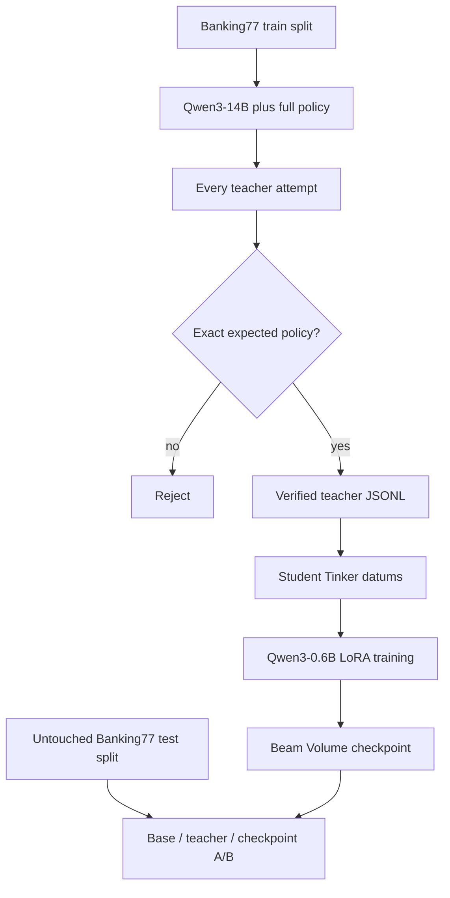

# Practical distillation

Distillation turns a strong model's verified answers into supervised examples
for a smaller, cheaper model. OpenTinker keeps the workflow inside Tinker's
normal sampling, datum, training, and checkpoint APIs; Beam supplies the GPU.

The complete example is
[`examples/distill_support_router.py`](../examples/distill_support_router.py).
For the objective functions, token masking, LoRA parameterization, and the
difference between sequence-level and logit distillation, see
[Fine-tuning and distillation: the ML view](ml-training.md).

## The task

[`mteb/banking77`](https://huggingface.co/datasets/mteb/banking77) contains
real online-banking questions labeled with 77 support intents. The example
selects 16 operationally useful and deliberately confusable intents, such as:

- `card_arrival` versus `card_delivery_estimate`
- `declined_card_payment` versus `pending_card_payment`
- `failed_transfer` versus `pending_transfer`
- `compromised_card` versus a specific unrecognized transaction

The policy also defines precedence for overlapping language. For example, a
transfer that is merely processing is `pending_transfer`; if a person,
retailer, or destination account is explicitly missing the money, it is
`transfer_not_received_by_recipient`. Ambiguous teacher answers are rejected
instead of silently changing the source label.

The deployed contract is strict:

```json
{"intent":"pending_transfer","queue":"bank_transfers","priority":"P2"}
```

This is a useful distillation target because inference is cheap with the 0.6B
student, correctness is measurable, and the 14B teacher can resolve semantic
distinctions that the untouched student cannot reliably follow.

## Data flow



The teacher sees the full list of intent definitions, queues, and priorities.
The student sees only:

```text
Route this banking support request. Return exactly one JSON object with the
keys intent, queue, and priority. Return no other text.

Customer message: <ticket>
```

That separation matters. If the full taxonomy were included at student
inference time, the example would mostly test prompt following rather than
whether the capability was transferred into the student adapter.

## Training records

The source row is ordinary dataset data:

```json
{"text":"cash transfer is pending","label_text":"pending_transfer"}
```

Every teacher attempt is written to `teacher_audit.jsonl`, including its parsed
answer and acceptance decision. Only exact, policy-consistent answers enter
`verified_teacher_data.jsonl`:

```json
{"prompt":"Customer message: cash transfer is pending","teacher_response":"{\"intent\":\"pending_transfer\",\"queue\":\"bank_transfers\",\"priority\":\"P2\"}","verified":true}
```

`distillation_records_to_datums(...)` converts accepted rows into student
conversations and applies loss only to the teacher response. It rejects rows
unless `verified` is explicitly true.

The dataset revision is pinned in the example, the train and test splits stay
separate, and sampling is deterministic. This makes a run inspectable and
repeatable without pretending teacher output is automatically trustworthy.

## Run it

The 14B teacher needs a GPU with enough memory. Use an on-demand L40S, A100,
H100, or a suitable private pool:

```bash
uv run python examples/distill_support_router.py \
  --profile default --on-demand --gpu L40S \
  --output ./runs/banking77-distillation
```

Important controls:

- `--train-per-intent`: accepted teacher examples required for each intent
- `--teacher-candidates-per-intent`: attempts available to fill each quota
- `--eval-per-intent`: held-out test rows per intent
- `--min-accuracy`: exact-match gate the distilled model must clear
- `--teacher` and `--student`: replace either Hugging Face model

The run stops before training if the teacher cannot fill every class quota. It
also exits nonzero if the checkpoint does not improve over the untouched
student or misses the minimum exact-match accuracy.

## Verified result

A complete `prod3` run generated 96 accepted rows from 114 teacher attempts,
trained on an L40S, persisted both checkpoints, terminated that pod and
reservation, and reloaded the sampler checkpoint in a separate A10G pod:

| Model | Held-out exact match |
| --- | ---: |
| Untouched Qwen3-0.6B | 0/32 (0.0%) |
| Qwen3-14B teacher | 31/32 (96.9%) |
| Distilled Qwen3-0.6B | 23/32 (71.9%) |
| Same checkpoint in fresh A10G pod | 23/32 (71.9%) |

The first and last logged training-minibatch NLL values were `2.654` and
`0.003`; because they came from different shuffled minibatches, they are not a
held-out before/after comparison. All 32 evaluation messages came from the
untouched Banking77 test split; none appeared in teacher generation or student
training.

## What the A/B proves

All three models receive the same untouched test messages:

1. The base student establishes whether the small model can already perform
   the task.
2. The teacher shows the available upper-bound behavior.
3. The student checkpoint shows what transferred through the verified dataset
   and LoRA training.

The exact metric requires the complete JSON object—including intent, queue,
priority, key set, and values—to match. Intent-only accuracy is also recorded
for diagnosis but cannot satisfy the success gate.

To prove the artifact is portable, evaluate it in a second Pod using only the
saved `tinker://` sampler handle:

```bash
uv run python examples/distill_support_router.py \
  --profile default --gpu A10G \
  --checkpoint tinker://<model-id>/sampler_weights/<name> \
  --output ./runs/banking77-checkpoint-eval
```

This creates a fresh base client and checkpoint client on the new GPU, repeats
the held-out A/B, and writes `checkpoint_evaluation.json`.

## Adapt it to your task

Keep four boundaries intact:

1. Use separate train and held-out sources.
2. Put rich task instructions on the teacher side, not in the student's
   deployed prompt.
3. Replace `parse_routing` and exact policy comparison with a verifier that
   represents real correctness: schema validation, code tests, execution,
   reward thresholds, or human approval.
4. Persist both accepted and rejected teacher attempts before training.

Once rows have `prompt`, `teacher_response`, and `verified`, the preprocessing
and training code can stay unchanged.
