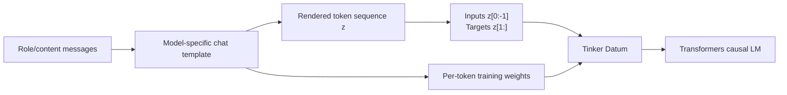

# Fine-tuning and distillation: the ML view

This document explains what OpenTinker actually optimizes, how conversations
become causal-language-model targets, what LoRA changes in the model, and how
the repository's distillation workflow differs from classical logit
distillation.

The short version is:

- **Supervised fine-tuning (SFT)** learns from targets supplied by a dataset.
- **OpenTinker's current distillation example** asks a larger teacher to
  generate target sequences, verifies those sequences, and then performs the
  same SFT procedure on a smaller student.
- **Both paths train LoRA adapters with masked next-token cross-entropy.**
- OpenTinker does **not** currently optimize a KL divergence against the
  teacher's full token distribution.

The runnable implementations are
[`examples/finetune_jsonl.py`](../examples/finetune_jsonl.py) and
[`examples/distill_support_router.py`](../examples/distill_support_router.py).

## 1. The shared learning problem

Let a rendered conversation be a token sequence

$$
z = (z_0, z_1, \ldots, z_{L-1}).
$$

The causal model receives

$$
x = (z_0, z_1, \ldots, z_{L-2})
$$

and predicts the left-shifted targets

$$
y = (z_1, z_2, \ldots, z_{L-1}).
$$

For position \(t\), the model defines

$$
p_\theta(y_t \mid x_{\leq t}).
$$

A renderer also produces a nonnegative weight \(w_t\) for every target token.
The per-example objective is

$$
\mathcal{L}_{\text{CE}}(\theta)
=
-\frac{\sum_t w_t \log p_\theta(y_t \mid x_{\leq t})}
       {\max(\sum_t w_t, 1)}.
$$

In the normal instruction-tuning configuration:

- tokens in the system and user messages have weight zero;
- tokens in the selected assistant response have positive weight;
- chat-template tokens may receive zero or positive weight depending on the
  renderer and `train_on` mode.

The user prompt is still in the model's causal context. A zero loss weight does
not hide it from the forward pass; it only prevents the model from being
directly optimized to reproduce that token.

OpenTinker computes one normalized loss per datum and averages datum losses
over the batch. For a batch \(B\),

$$
\mathcal{L}_B = \frac{1}{|B|}\sum_{i \in B}\mathcal{L}_i.
$$

`forward_backward(...)` accumulates gradients for this objective.
`optim_step(...)` applies AdamW and zeros the gradients.

## 2. From messages to a Tinker `Datum`

Training data starts as readable conversations:

```json
{
  "messages": [
    {"role": "system", "content": "Return a support route as JSON."},
    {"role": "user", "content": "Someone used my card."},
    {
      "role": "assistant",
      "content": "{\"intent\":\"card_payment_not_recognised\",\"queue\":\"fraud_review\",\"priority\":\"P0\"}"
    }
  ]
}
```

The path from this object to the GPU is:



### 2.1 Rendering is part of the model definition

`opentinker.data` delegates rendering to the official Tinker Cookbook. The
renderer supplies the model's chat syntax, control tokens, role headers, stop
sequences, and tokenizer. Qwen and Llama conversations are therefore not
treated as interchangeable strings.

This matters because the model was pretrained or instruction-tuned on a
particular serialization. Training on the wrong role syntax can waste capacity
learning a new protocol or can put the answer boundary in the wrong place.

### 2.2 Right shifting

The Cookbook constructs the full rendered `ModelInput` and a weight vector
aligned to it. It then:

1. truncates the rendered sequence from the right to `max_length`;
2. removes the last input token;
3. removes the first target token;
4. slices the weights so they align with the targets.

Conceptually:

```text
rendered:  [BOS, user, ..., assistant, answer_0, answer_1, EOS]
input:     [BOS, user, ..., assistant, answer_0, answer_1]
target:    [user, ..., assistant, answer_0, answer_1, EOS]
weights:   [  0, ...,         0,        1,        1,   1]
```

The exact boundary weights are renderer-dependent, but the alignment is always
input position \(t\) predicting target position \(t\).

Right truncation is worth treating as a data-quality operation, not a harmless
implementation detail. If `max_length` cuts off most of the assistant answer,
the example contributes little useful supervision. Length distributions and
post-render loss-mask sums should be inspected before a serious run.

### 2.3 Loss-mask modes

The main modes exposed by `opentinker.data` are:

- `last_assistant_message`: only the final assistant message;
- `last_assistant_turn`: the last assistant/tool interaction;
- `all_assistant_messages`: all assistant responses in a multi-turn example;
- `all_messages`: all message content;
- `all_tokens`: content and template tokens;
- `customized`: explicit per-message `trainable` flags.

`last_assistant_message` is the safest default for single-turn instruction
tuning and sequence distillation. Training on user tokens changes the
objective: the model spends capacity modeling the input distribution rather
than only the conditional answer distribution.

### 2.4 Per-example normalization

With `reduction="mean"`, the Cookbook normalizes each example's weights to sum
to one before it reaches the engine. The engine divides by their sum again,
which remains one. As a result, short and long answers have approximately
equal example-level influence.

There is an implementation-specific subtlety here. OpenTinker's current engine
always divides each datum's weighted loss by that datum's weight sum and then
averages datums. Multiplying every weight in one datum by a constant therefore
does not change its training gradient. In this backend, `reduction="none"` does
not turn the optimizer objective into a token-sum objective across examples.

It can still change reported aggregate NLL. `mean_nll(...)` combines weights
across the batch: normalized weights give every example equal total metric
weight, while raw binary masks give longer answers more metric weight. Thus
`reduction="none"` can make the logged aggregate use token weighting even
though the backend's gradient remains an average of per-datum means. The
provided SFT and distillation helpers use `reduction="mean"` so the optimization
and aggregate metric both have clear example-balanced semantics.

## 3. What is being updated: LoRA, not the base model

OpenTinker loads the Hugging Face causal LM in BF16 when supported, otherwise
FP16. The base parameters are frozen and PEFT inserts low-rank updates into
selected linear layers.

For a frozen weight matrix \(W_0 \in \mathbb{R}^{d_{\text{out}}\times
d_{\text{in}}}\), LoRA learns

$$
W = W_0 + \frac{\alpha}{r}BA,
$$

where

$$
A \in \mathbb{R}^{r \times d_{\text{in}}}, \qquad
B \in \mathbb{R}^{d_{\text{out}} \times r}.
$$

The implementation sets:

- rank \(r\) from the Tinker LoRA configuration; the examples use \(r=8\);
- \(\alpha=r\), so the explicit scaling factor \(\alpha/r\) is one;
- LoRA dropout to zero;
- bias training to `"none"`.

By default it targets architecture-compatible modules among:

- attention projections: `q_proj`, `k_proj`, `v_proj`, `o_proj`, or fused
  `query_key_value`;
- MLP projections: `gate_proj`, `up_proj`, `down_proj`, `fc1`, `fc2`, and
  common fused equivalents;
- `lm_head`, when the architecture exposes it and unembedding training is
  enabled.

The `lm_head` is still adapted with a low-rank update; OpenTinker does not
unfreeze the full head.

Gradient checkpointing is enabled when the model supports it, and the
transformer KV cache is disabled during training. This trades additional
forward computation for lower activation memory.

### 3.1 Parameter count intuition

A LoRA update adds approximately

$$
r(d_{\text{in}} + d_{\text{out}})
$$

parameters to a \(d_{\text{out}}\times d_{\text{in}}\) matrix instead of
\(d_{\text{out}}d_{\text{in}}\) full-rank parameters. The reduction is large
when \(r \ll \min(d_{\text{in}}, d_{\text{out}})\).

This reduces optimizer-state and gradient memory, but the frozen base model
must still reside on the GPU. LoRA makes a model cheaper to train; it does not
make a 14B model occupy 0.6B-model memory.

### 3.2 Optimizer behavior

Only parameters whose `requires_grad` flag is true are passed to AdamW. The
examples use:

```text
learning rate = 1e-3
beta1         = 0.9
beta2         = 0.95
epsilon       = 1e-8
weight decay  = 0 unless explicitly set
```

The learning rate is high relative to full-model fine-tuning but common for
small LoRA runs. It is not universally safe: larger datasets, higher ranks,
different base models, or noisier targets may require a lower rate and a
schedule.

## 4. Supervised fine-tuning

In SFT, the dataset directly supplies the desired completion:

$$
\mathcal{D}_{\text{SFT}} = \{(x_i, y_i)\}_{i=1}^{N}.
$$

The optimization problem is

$$
\theta^*
=
\arg\min_\theta
\frac{1}{N}
\sum_{i=1}^{N}
\mathcal{L}_{\text{CE}}(x_i, y_i; \theta),
$$

where \(\theta\) denotes the LoRA parameters rather than all base-model
parameters.

### 4.1 The repository's JSONL loop

[`examples/finetune_jsonl.py`](../examples/finetune_jsonl.py) performs:

1. JSONL parsing and message validation.
2. Model-specific rendering and tokenization.
3. A no-gradient forward pass on an evaluation batch.
4. Deterministic shuffling at each epoch.
5. `forward_backward` on every minibatch.
6. AdamW `optim_step`.
7. Another no-gradient forward pass on the same evaluation batch.
8. State and sampler checkpoint creation.

In pseudocode:

```python
client = service.create_lora_training_client(
    base_model=model,
    rank=8,
    seed=0,
)

initial = client.forward(eval_batch, loss_fn="cross_entropy")

for epoch in range(epochs):
    shuffle(train_datums)
    for batch in batches(train_datums):
        backward = client.forward_backward(batch, loss_fn="cross_entropy")
        update = client.optim_step(adam_params)
        backward.result()
        update.result()

final = client.forward(eval_batch, loss_fn="cross_entropy")
```

The calls return Tinker futures. The compatibility endpoint executes model
operations serially, so the optimizer step follows the corresponding backward
pass even though the client can create both futures before awaiting them.

### 4.2 Interpreting NLL

The evaluation helper computes

$$
\operatorname{NLL}
=
-\frac{\sum_{i,t} w_{i,t}\log p_\theta(y_{i,t}\mid x_{i,\le t})}
       {\sum_{i,t}w_{i,t}}.
$$

With one normalized weight vector per example, this is effectively an average
of example-level mean NLLs.

Lower held-out NLL means the tuned model assigns more probability to the
reference answers under teacher forcing. It does not by itself prove that:

- free-running generations are correct;
- the model follows the schema exactly;
- calibration improved;
- the capability generalizes beyond the held-out distribution;
- unrelated capabilities were preserved.

The example uses at most eight evaluation datums. If `--eval-data` is omitted,
it reuses training examples, which is an end-to-end wiring check rather than a
generalization measurement.

For a production fine-tune, pair held-out NLL with task metrics on decoded
outputs: exact match, execution success, unit tests, preference judgments,
schema validity, or an application-specific cost function.

### 4.3 What SFT is doing geometrically

The pretrained model already represents many relevant features. SFT need not
learn language or domain concepts from scratch. The LoRA update changes how
those features are combined so that the conditional distribution places mass
on the desired behavior:

- the correct answer style;
- a task-specific ontology;
- a particular JSON or tool protocol;
- product policies;
- domain-specific distinctions.

The low-rank constraint is an inductive bias: the required behavioral update is
assumed to lie in a comparatively low-dimensional subspace of the base model's
weight space. When the task needs genuinely new factual capacity or a large
distribution shift, a small-rank adapter and a small dataset may be
insufficient.

## 5. Distillation: several different objectives share the name

“Knowledge distillation” can refer to materially different algorithms.

### 5.1 Classical logit distillation

For a classification model with teacher logits \(u\), student logits \(v\),
and temperature \(T\), classical distillation often includes

$$
\mathcal{L}_{\text{KD}}
=
T^2
\operatorname{KL}
\left(
\operatorname{softmax}(u/T)
\;\|\;
\operatorname{softmax}(v/T)
\right).
$$

The soft teacher distribution contains information that a one-hot label does
not: relative similarity between incorrect classes, sometimes called “dark
knowledge.”

For autoregressive language models, an analogous loss can compare the
teacher's and student's next-token distributions at every target position:

$$
\sum_t
\operatorname{KL}
\left(
p_T(\cdot \mid y_{<t},x)
\;\|\;
p_S(\cdot \mid y_{<t},x)
\right).
$$

This is difficult when teacher and student use different vocabularies or
tokenizers, and expensive when the full vocabulary distribution must be stored
or transferred.

OpenTinker does not currently implement this loss. Its sampling API returns
generated tokens and their selected-token log probabilities, not a dense
teacher distribution suitable for vocabulary-level KL.

### 5.2 Sequence-level distillation

OpenTinker currently implements sequence-level distillation:

1. Sample a complete output \(\hat y_i\) from a teacher.
2. Verify or score \(\hat y_i\).
3. Keep accepted prompt/output pairs.
4. Train the student with ordinary hard-target cross-entropy.

Formally, the teacher constructs a new dataset

$$
\mathcal{D}_{T}
=
\left\{
(x_i,\hat y_i)
:
\hat y_i \sim p_T(\cdot\mid x_i),
\; V(x_i,\hat y_i)=1
\right\},
$$

and the student solves

$$
\theta_S^*
=
\arg\min_{\theta_S}
\sum_{(x,\hat y)\in\mathcal{D}_T}
\mathcal{L}_{\text{CE}}(x,\hat y;\theta_S).
$$

The teacher and student can use different tokenizers because the boundary
between them is decoded text. The teacher generates a string; the student's
renderer tokenizes that string independently.

This approach transfers:

- the teacher's chosen decisions;
- canonical output structure;
- task-specific terminology;
- concise solution traces or plans, if those are included in the target;
- any systematic biases that pass the verifier.

It does not transfer the teacher's full uncertainty distribution. Each
accepted sequence becomes a point target.

### 5.3 Verification changes the training distribution

The verifier is not merely a safety check. It defines the effective student
dataset:

$$
p_{\text{train}}(x,\hat y)
\propto
p_{\text{candidate}}(x)
p_T(\hat y\mid x)
\mathbf{1}[V(x,\hat y)=1].
$$

If the teacher fails more often on hard, rare, or ambiguous examples,
rejection sampling shifts the accepted dataset toward easier examples. A
per-class quota fixes class counts but not within-class difficulty bias.

Useful diagnostics therefore include:

- acceptance rate by class and source;
- rejected-answer taxonomy;
- candidate difficulty versus accepted difficulty;
- duplicate and near-duplicate rates;
- performance on an untouched source distribution.

Multiple teacher samples, self-consistency, a repair pass, or human review can
increase yield, but each changes the data-generating process and should be
recorded.

## 6. The Banking77 experiment, precisely

The practical example uses Qwen3-14B as teacher and Qwen3-0.6B as student.
It selects 16 intents from the Banking77 dataset.

### 6.1 Splits and balancing

- Candidate prompts come from the official training split.
- Held-out prompts come from the official test split.
- Up to 20 candidates are available per selected intent.
- The run requires 6 verified teacher outputs per intent.
- The resulting student set has \(16\times6=96\) examples.
- Evaluation uses 2 test examples per intent, for 32 total.

The split separation prevents literal train/test reuse. The 32-example test is
still small; it gives a useful integration-level signal, not a precise estimate
of deployment accuracy.

### 6.2 Teacher view versus student view

The teacher receives:

- the raw customer message;
- definitions of all 16 intents;
- the queue and priority associated with each intent;
- precedence rules for ambiguous classes;
- the exact JSON schema.

The student receives only:

```text
Route this banking support request. Return exactly one JSON object with the
keys intent, queue, and priority. Return no other text.

Customer message: <message>
```

Withholding the full teacher policy from the student matters. Otherwise much
of the apparent capability could come from inference-time context rather than
the adapter.

### 6.3 Teacher generation

The teacher is sampled greedily:

```text
temperature = 0
num_samples = 1
maximum new tokens = 96
```

Teacher sampling and student training happen in separate phases. On one GPU,
the sampling model is cleared before the student training model is loaded. On
a multi-GPU run, sampling replicas use the visible devices and student
training switches to DDP replicas on the same devices. A sampling call with
multiple completions divides those completions among ranks; a one-completion
call uses one rank.

### 6.4 Verification

A teacher response is accepted only when:

1. the entire response parses as one JSON object;
2. it has exactly the keys `intent`, `queue`, and `priority`;
3. every value is a string;
4. the complete object equals the policy-derived expected answer for the
   dataset label.

The verifier therefore checks semantics against known ground truth, not just
syntax. Every attempt is written to `teacher_audit.jsonl`; only accepted rows
enter `verified_teacher_data.jsonl`.

### 6.5 Student optimization

The verified teacher string is used as the final assistant response.
`distillation_records_to_datums(...)` selects
`train_on="last_assistant_message"`, so the loss is applied to the teacher
answer rather than the prompt.

The verified run used:

```text
student             Qwen/Qwen3-0.6B
LoRA rank           8
examples            96
batch size          8
epochs              8
optimizer steps     96
learning rate       1e-3
Adam betas          (0.9, 0.95)
```

### 6.6 Results

| Model | Held-out exact match |
| --- | ---: |
| Untouched Qwen3-0.6B | 0/32 (0.0%) |
| Qwen3-14B teacher | 31/32 (96.9%) |
| Distilled Qwen3-0.6B | 23/32 (71.9%) |
| Same checkpoint in a fresh A10G Pod | 23/32 (71.9%) |

The first and last logged training-minibatch NLL values were `2.654` and
`0.003`. They are not a held-out before/after comparison: they come from
different shuffled minibatches. The exact-match result is the relevant
generalization measurement for this run.

The untouched student's `0/32` should also be interpreted carefully. Exact
match requires canonical intent strings, queue names, priority values, and no
extra keys or prose. The base model often produced semantically plausible but
noncanonical labels. The result proves it could not satisfy this deployed
contract, not that it had zero prior knowledge of banking support.

The distilled model's remaining errors cluster around genuinely confusable or
underspecified examples:

- card arrival status versus a delivery-time estimate;
- a specific unrecognized card payment versus general card compromise;
- failed, pending, and recipient-missing transfers;
- identity-verification trouble versus a broader security problem.

That error profile is more informative than the training loss: it points
directly to coverage gaps and ambiguous label boundaries.

### 6.7 An important caveat: the teacher is optional for this exact dataset

Banking77 already supplies the intent label, and the example's policy
deterministically maps that label to a queue and priority. The desired JSON
target could therefore be constructed directly:

```python
target = {
    "intent": row["label_text"],
    "queue": policy[row["label_text"]].queue,
    "priority": policy[row["label_text"]].priority,
}
```

That would be ordinary SFT and would be cheaper than invoking Qwen3-14B.

Consequently, the Banking77 run proves that the end-to-end teacher generation,
verification, student training, checkpoint persistence, and A/B machinery
works. It is best described as **verified sequence-level distillation or
teacher-mediated data synthesis**, but it is not a case where the teacher is
the only source of the target knowledge.

A stronger production distillation use case starts with one or more of:

- unlabeled inputs for which no direct target exists;
- a target richer than the source label, such as a resolution plan;
- teacher behavior validated by execution, tests, or external facts;
- expensive reasoning traces compressed into shorter deployable answers;
- human preference or reward signals used to accept teacher outputs.

In those settings, removing the teacher would remove information rather than
only removing a data-generation stage.

## 7. SFT and sequence distillation compared

| Property | SFT | Sequence-level distillation |
| --- | --- | --- |
| Target source | Human, product, or labeled dataset | Sampled teacher output |
| Training loss | Masked token CE | The same masked token CE |
| Teacher used during backprop | No | No |
| Teacher and student resident together | Not applicable | Not required |
| Different tokenizers | Not relevant | Supported through decoded text |
| Soft class/token information | No | No |
| Critical failure mode | Bad or leaky labels | Teacher errors and verifier bias |
| Main cost | Student training | Teacher generation plus student training |
| Best evaluation | Held-out task behavior | Base/teacher/student held-out A/B |

The training phase is identical after the target dataset exists. Distillation
changes the provenance and filtering of \(y\), not the student's cross-entropy
implementation.

## 8. Runtime mapping: where the ML operations happen

The local process owns orchestration and the Beam/Beta9 Pod owns model
computation:

```mermaid
sequenceDiagram
    participant Loop as Local Tinker loop
    participant API as Tinker-compatible Pod API
    participant GPU as torchrun + Transformers/PEFT
    participant Vol as Beam Volume

    Loop->>API: create_lora_training_client
    API->>GPU: load frozen base + initialize LoRA
    Loop->>API: forward_backward(datums)
    API->>GPU: logits, weighted CE, backward
    Loop->>API: optim_step(AdamParams)
    API->>GPU: AdamW update on LoRA params
    Loop->>API: save_state / save_weights_for_sampler
    API->>Vol: adapter and optional optimizer state
```

The HTTP boundary does not change the objective. It allows the upstream Tinker
clients and futures to drive a PyTorch/PEFT implementation on the selected
machine.

With `gpu_count > 1`, Beta9 assigns all devices to one container and
OpenTinker runs one process per device. Each rank receives a disjoint slice of
the global datum batch. DDP averages gradients across ranks, while OpenTinker
scales each rank-local loss so that the result is the same global example mean
as single-GPU training. NCCL performs the collectives and follows the machine's
CUDA topology, including NVLink/NVSwitch when present.

### 8.1 Forward and backward

For each datum, the engine:

1. sends input tokens to the causal LM;
2. converts logits to FP32 before `log_softmax`;
3. gathers the log probability of each target token;
4. multiplies negative log probabilities by the datum weights;
5. normalizes and backpropagates the batch-average loss.

`forward(...)` uses the same calculation under `torch.no_grad()` and does not
change the model.

### 8.2 Sampling

Sampling loads either:

- an untouched Hugging Face base model; or
- that base model plus a PEFT adapter from a checkpoint.

The distillation evaluation uses temperature zero. Generated token IDs,
selected-token log probabilities, and stop reasons are returned through the
Tinker `SamplingClient`.

### 8.3 Checkpoints

A sampler checkpoint contains:

- PEFT adapter configuration;
- LoRA adapter weights;
- OpenTinker metadata identifying the base model and rank.

A state checkpoint also contains `optimizer.pt`, enabling AdamW-state resume.
Neither checkpoint duplicates the frozen Hugging Face base model.

The `tinker://` URI identifies the SDK-facing artifact. Its files live on the
named Beam Volume, so a new Pod can load the same adapter after the training
machine has exited.

Saving is a synchronous durability boundary even when the Volume uses geesefs
staged writes. For each file, OpenTinker hashes the bytes copied from local
checkpoint staging, stores that digest in the `--content-sha256` object
metadata, and calls `fsync()` while still inside the Pod. On Beta9, that call
blocks until the staged object upload completes. The save succeeds only if the
mounted filesystem then exposes both the same SHA-256 and the remote ETag.
`opentinker-checksums.json` records the payload hashes. No checkpoint object is
downloaded again during verification.

## 9. Experimental design and common traps

### 9.1 Separate three kinds of data

For serious distillation, keep:

1. **teacher-generation inputs**, used to create student targets;
2. **development inputs**, used to change prompts, policies, hyperparameters,
   and verifier behavior;
3. **final test inputs**, touched only for the final comparison.

Using the test set repeatedly while tuning makes it a development set.

### 9.2 Compare against the right baselines

At minimum:

- untouched student;
- teacher with its full teacher prompt;
- distilled checkpoint with the deployed student prompt.

Often add:

- direct SFT from available human labels;
- a larger student without adaptation;
- a prompt-only student with the full policy;
- a simple classifier or deterministic system;
- cost and latency per request.

The direct-SFT baseline is particularly important when source labels already
exist. Without it, one cannot attribute gains specifically to teacher
distillation.

### 9.3 Evaluate the artifact, not only live weights

Reloading the sampler checkpoint in a fresh Pod catches:

- missing or partially synced adapter files;
- incorrect base-model metadata;
- accidental dependence on in-memory state;
- checkpoint path and Volume errors.

It does not replace behavioral evaluation, but it closes an important systems
gap between a training metric and a deployable model.

### 9.4 Acceptance filtering can hide teacher weaknesses

A high student score on a heavily filtered dataset does not mean the teacher
is reliable on the original input distribution. Always report attempted and
accepted counts, and evaluate the teacher independently on held-out inputs.

### 9.5 Very low training loss is not the goal

With 96 examples and eight epochs, a 0.6B model with rank-8 adapters can nearly
memorize canonical outputs. A loss near zero mainly says the adapter fits the
accepted sequences under teacher forcing. The gap between that loss and
`71.9%` exact match is the generalization problem in plain sight.

### 9.6 Structured outputs have coupled errors

Exact-match failure can come from:

- semantic classification;
- invalid syntax;
- wrong key names;
- a correct intent with an inconsistent queue;
- extra prose;
- generation truncation.

Record component metrics and parser failures, but keep the end-to-end metric
aligned with deployment. A valid intent inside unusable JSON may still be a
production failure.

## 10. What OpenTinker does not currently implement

The current single-node backend does not provide:

- full-vocabulary teacher-logit KL distillation;
- hidden-state or attention-map matching;
- multi-teacher mixture losses;
- online/on-policy teacher feedback during every student update;
- multi-node training or parameter-sharded training;
- arbitrary custom differentiable losses;
- multimodal training in the token-only backend.

The engine does implement an importance-sampling loss for compatible Tinker
datums, but the provided distillation workflow does not use it. It should not
be confused with teacher-logit distillation.

## 11. A practical decision rule

Use direct SFT when:

- trustworthy targets already exist;
- a deterministic transformation can construct the target;
- the target is simpler than what a teacher would generate.

Use sequence-level distillation when:

- inputs are plentiful but targets are scarce;
- a teacher can synthesize richer behavior;
- correctness can be verified or scored;
- the smaller model materially reduces inference cost or latency.

Use logit-level distillation when:

- access to teacher distributions is available;
- teacher/student token spaces can be aligned;
- the extra storage and compute are justified by the value of soft targets.

In all three cases, the central ML problem is not getting training loss to
decrease. It is constructing an objective and evaluation distribution whose
improvements correspond to the behavior that will matter after deployment.
