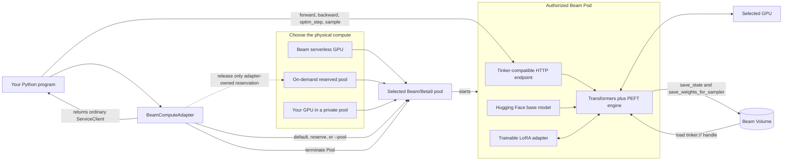
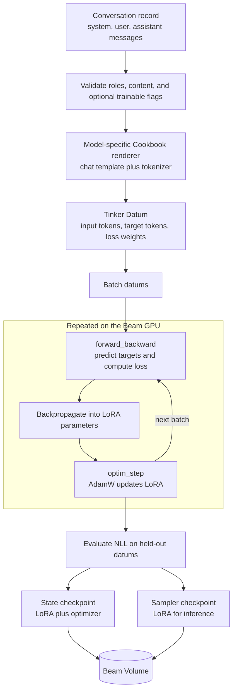
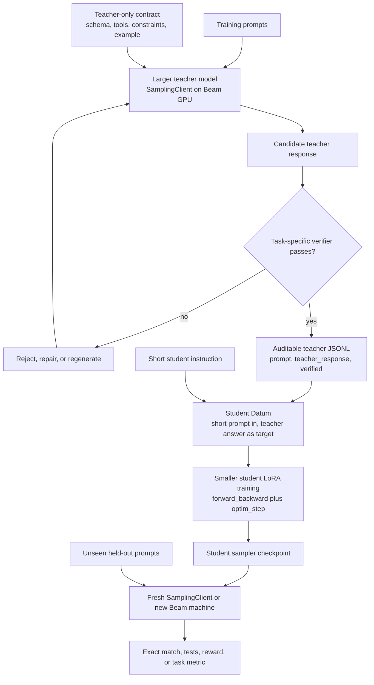

# System diagrams

The diagrams place each operation next to the component that owns it.

## The shared system

Both fine-tuning and distillation use the same runtime architecture:

### What each part means

- **Your Python program** contains familiar Tinker or Cookbook code. It decides
  which examples form a batch and when to train, evaluate, sample, or save.
- **`BeamComputeAdapter`** builds the image, defaults to serverless capacity,
  opens Beam's hardware picker when requested, or targets your existing pool.
  The adapter starts the Pod and returns a normal Tinker `ServiceClient`.
- **A selected pool** forms the scheduling boundary. It may contain Beam
  capacity or a machine you attached with `beam pool join`; the Tinker workflow
  above it is identical.
- **HTTP compatibility** is necessary because the upstream Tinker SDK speaks
  HTTP. An endpoint inside the Pod implements the relevant Tinker service
  contract; it is not a hosted Tinker training endpoint.
- **Transformers/PEFT** loads the Hugging Face base model and owns
  the trainable LoRA adapter, gradients, AdamW state, and generation calls.
- **GPU execution** covers the forward pass, backward pass,
  optimizer work, and token generation.
- **Durable storage** uses a Beam Volume for adapter weights and optimizer state
  after the Pod exits. `tinker://` is the SDK-facing handle for the
  corresponding Volume directory.

See [Bring your own hardware](bring-your-own-hardware.md) for the exact
serverless, on-demand reservation, private pool, installer, and self-hosted
Beta9 commands.

## Supervised fine-tuning

Fine-tuning teaches a model from approved input/output examples. Each
conversation says, in effect, “when the input looks like this, produce this
answer.”

### Fine-tuning, step by step

1. **Create examples.** Store one conversation per JSONL row. The assistant
   message is the desired output; system and user messages are its context.
2. **Validate and render.** `opentinker.data` checks the readable record. The
   model's Cookbook renderer applies the correct chat template and tokenizer.
3. **Build a `Datum`.** A datum contains model input tokens, the next-token
   targets, and loss weights. The weights decide which tokens teach the model.
   For instruction tuning, only assistant-answer tokens normally receive loss.
4. **Train on Beam.** `forward_backward` measures prediction error and computes
   gradients. `optim_step` updates only the LoRA parameters, leaving the base
   model frozen.
5. **Evaluate.** Before/after NLL on held-out examples shows whether the tuned
   model became better at the desired answers.
6. **Save two useful artifacts.** A state checkpoint includes optimizer state
   for resuming training. A sampler checkpoint contains what inference needs.

The complete runnable path is
[`examples/finetune_jsonl.py`](../examples/finetune_jsonl.py); the precise data
schema and loss-mask choices are in [Data preparation](data-preparation.md).

## Sequence-level distillation

Distillation uses a stronger teacher to create answers for a smaller student.
The generated answers become supervised examples only after verification.

### Distillation, step by step

1. **Choose a capability and prompts.** The prompts must cover the behavior the
   smaller model should learn. Keep a separate held-out set for evaluation.
2. **Give the teacher enough structure.** A capable teacher may receive a rich
   contract containing tool schemas, formatting rules, constraints, and an
   example. This contract helps generate consistent training answers.
3. **Generate candidates on Beam.** A Tinker `SamplingClient` runs the teacher
   on the Beam GPU. Teacher and student may use different base models in the
   same adapter workflow.
4. **Verify before learning.** A verifier rejects malformed or incorrect
   answers. It can be exact JSON comparison, JSON Schema, unit tests, execution,
   a reward threshold, or human approval. Unverified teacher output should not
   silently become ground truth.
5. **Persist the accepted dataset.** Each accepted row stores `prompt`,
   `teacher_response`, and `verified: true`. This makes the teacher data
   inspectable and reproducible.
6. **Construct the student view.** The student receives the short instruction
   and prompt—not necessarily the teacher's full contract. The verified teacher
   response is the assistant target and is the only text that receives loss.
7. **Train like ordinary SFT.** Once teacher outputs are accepted, student
   training is normal supervised LoRA training through Tinker's datum,
   forward/backward, optimizer, and checkpoint APIs.
8. **Test the saved artifact.** Load the sampler checkpoint through a fresh
   client, ideally on a new machine, and score only unseen prompts. Compare it
   with the untouched student and teacher so the transfer is measurable.

The runnable
[`distill_support_router.py`](../examples/distill_support_router.py) uses the
real Banking77 train/test splits and an exact support-policy verifier. See
[Practical distillation](distillation.md) for its data contract and inference
A/B design.

## Fine-tuning versus distillation

| Question | Supervised fine-tuning | Sequence-level distillation |
| --- | --- | --- |
| Where do target answers come from? | Approved human, product, or historical data | A stronger teacher model, after verification |
| Input record | `messages` conversation | `prompt` plus `teacher_response` |
| What receives loss? | Usually assistant messages | Only the accepted teacher response |
| Extra model required? | No | Yes, a teacher during dataset generation |
| Critical quality gate | Clean labels and a held-out split | A verifier that blocks bad teacher outputs |
| Training operation | LoRA supervised training | The same LoRA supervised training after teacher-data creation |
| Final artifact | State and sampler checkpoints | Student state and sampler checkpoints |

**Distillation changes how labels are produced, not how accepted labels are
trained.** After verification, both paths use the same Tinker datum and Beam GPU
training loop.
